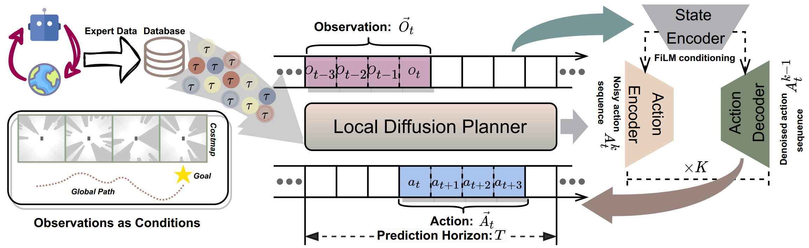

# LDP: A Local Diffusion Planner for Efficient Robot Navigation and Collision Avoidance

[[Project page]](https://github.com/WenhaoYu1998/LDP)
[[Paper]](https://arxiv.org/abs/2407.01950)
[[Data]](https://github.com/WenhaoYu1998/LDP)

[Wenhao Yu](http://wenhaoyu1998.github.io/)<sup>1</sup>,
[Jie Peng]()<sup>1</sup>,
[Huanyu Yang]()<sup>1</sup>,
[Junrui Zhang]()<sup>1</sup>,
[Yifan Duan](https://yjsx.top/)<sup>1</sup>,
[Jianmin Ji](http://staff.ustc.edu.cn/~jianmin/)<sup>1</sup>,
[Yanyong Zhang](http://staff.ustc.edu.cn/~yanyongz/)<sup>1</sup>

<sup>1</sup>University of Science and Technology of China USTC,



## 🚀 Runing
### 🖥️ Environment
To reproduce our training results, install our conda environment on a Linux machine with Nvidia GPU. On Ubuntu 20.04 you need to install the following apt packages:

We recommend [Mambaforge](https://github.com/conda-forge/miniforge#mambaforge) instead of the standard anaconda distribution for faster installation: 
```console
$ mamba env create -f ldp_environment.yaml
```

but you can use conda as well: 
```console
$ conda env create -f ldp_environment.yaml
```

### 🌏 Simulation
#### Expert Policy Training

In order to show the code more clearly, please refer to the sub-repository [LDP_SAC_expert](https://github.com/WenhaoYu1998/LDP_SAC_expert) for details.

#### Expert Data Collection

Since the simulator will fail to reset and get stuck when there are many obstacles, we pre-generate scene images of complex static scenarios instead of regenerating them in real time.

##### Static Scenarios

```console
# Open a new terminal
[LDP]$ cd data_collection/drlnav_env
[drlnav_env]$ source devel/setup.bash
[drlnav_env]$ roslaunch img_env test.launch
```

```console
# Open another new terminal
[LDP]$ cd data_collection/drlnav_env
[drlnav_env]$ source devel/setup.bash # NOTE: This source instruction is very important.
[drlnav_env]$ cd ../collect_data_only_static
[collect_data_only_static]$ chmod +x run_drl_test.sh
[collect_data_only_static]$ ./run_drl_test.sh
```

##### Other Scenarios

```console
# Open a new terminal
[LDP]$ cd data_collection/drlnav_env
[drlnav_env]$ source devel/setup.bash
[drlnav_env]$ roslaunch img_env test.launch
```

```console
# Open another new terminal
[LDP]$ cd data_collection/drlnav_env
[drlnav_env]$ source devel/setup.bash # NOTE: This source instruction is very important.
[drlnav_env]$ cd ../collect_data
[collect_data]$ chmod +x run_drl_test.sh
[collect_data]$ ./run_drl_test.sh
```
<a name="expert-data-processing"></a>
#### Expert Data Processing
Generate different config files for different typrs of data:
```console
[data_process]$ python yaml_generation.py --pkl_path your_data_pkl_path.pkl
```
Tansform the pkl data to zarr format for data loading:
```console
[data_process]$ python pkl2zarr.py --pkl_path your_data_pkl_path.pkl
```

## 🖥️ Reproducing Results
### Download Training Data

Under the repo root, create data subdirectory:
```console
[LDP]$ mkdir data 
```

Download the corresponding zip file from [Google Drive](https://drive.google.com/drive/folders/1ZsuU40BiksTwMriXqyw3BRMW5d5orpB_?usp=sharing)

Extract training data:
```console
[LDP]$ cd dataset_process
[dataset_process]$ unzip maze.zip && rm -f maze.zip
```

Next, you need to process these data into a format that can be used by our code, please refer to the [Expert Data Processing](#expert-data-processing) section.

Then, you copy the processed zarr data to the `data` directory.

### Running for a single seed
Activate conda environment.
```console
[LDP]$ conda activate ldp
```

Launch training with seed 42 on GPU 0.
```console
(ldp)[diffusion_policy]$ python train.py --config-dir=./config --config-name=image_nav_diffusion_policy_cnn.yaml training.seed=42 training.device=cuda:0 hydra.run.dir='data/outputs/${now:%Y.%m.%d}/${now:%H.%M.%S}_${name}_${task_name}'
```

This will create a directory in format `data/outputs/yyyy.mm.dd/hh.mm.ss_<method_name>_<task_name>` where configs, logs and checkpoints are written to. 

### 🆕 Evaluate Checkpoints

To evaluate a trained checkpoint, you can use the `eval.py` script.

##### Static Scenarios

```console
# Open a new terminal
[LDP]$ cd evaluation/drlnav_env
[drlnav_env]$ source devel/setup.bash
[drlnav_env]$ roslaunch img_env test.launch
```

```console
# Open another new terminal
[LDP]$ cd evaluation/drlnav_env
[drlnav_env]$ source devel/setup.bash # NOTE: This source instruction is very important.
[drlnav_env]$ cd ../local-diffusion-planner-only-static
[local-diffusion-planner-only-static]$ python eval.py --checkpoint data/outputs/checkpoint/ldp_static.ckpt --output_dir data/nav_output --yaml envs/cfg/circle.yaml --model_type diffusion --extro_condition gpath --device cuda:0
```

##### Other Scenarios

```console
# Open a new terminal
[LDP]$ cd evaluation/drlnav_env
[drlnav_env]$ source devel/setup.bash
[drlnav_env]$ roslaunch img_env test.launch
```

```console
# Open another new terminal
[LDP]$ cd evaluation/drlnav_env
[drlnav_env]$ source devel/setup.bash # NOTE: This source instruction is very important.
[drlnav_env]$ cd ../local-diffusion-planner
[local-diffusion-planner]$ python eval.py --checkpoint data/outputs/checkpoint/ldp_maze.ckpt --output_dir data/nav_output --yaml envs/cfg/maze.yaml --model_type diffusion --extro_condition gpath --device cuda:0
```

Tips: In file `test.launch`, `<node pkg = "img_env" type = "img_env_node" name = "image_ped_circle0" output = "screen" respawn = "true" > </node>` represents an environment node. Therefore, the `node_id` in the last line of the `*.yaml` file corresponds to the node. By modifying this option, multiple algorithms or models can be tested simultaneously.

### 🔑 Supplement
Our project code is based on the [Diffusion Policy](https://github.com/wjh720/Diffusion_Policy_Learning) projects. 
We mainly changed the following files:
- config/*yaml: 
  - add and modify new hyperparameters for LDP.
- diffusion_policy/workspace/train_nav_*_workspace.py: 
  - remove the inference evaluation during training, because the experimental simulation environment currently does not support direct Python calls.
- diffusion_policy/dataset/nav_image_dataset.py:
  - support loading of navigation data.


## 🙏 Acknowledgement
Our policy code is based on the [Diffusion Policy](https://github.com/real-stanford/diffusion_policy) projects. We thank the authors for their excellent work.